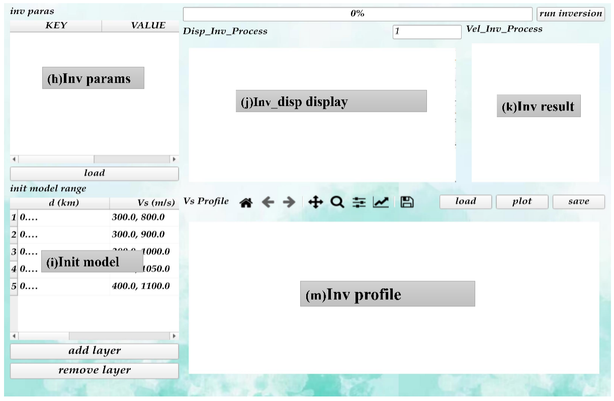
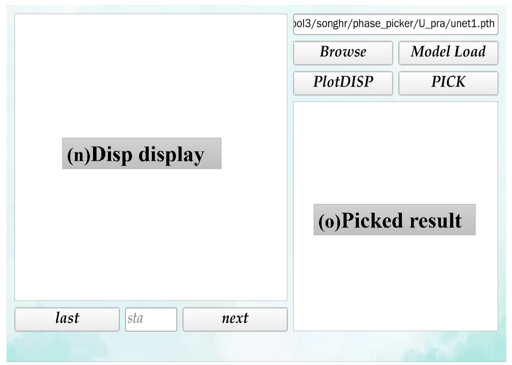

.. |main| image:: ../FIGS/main.png
    :height: 300

UI
==================================================

1. Main Interface
-----------------

The main window integrates core functions related to data preprocessing and 
forward modeling analysis.

|main|

The Inversion Window  is designed for result interpretation and model construction, centrally displaying functions related to inversion analysis such as inversion calculations, inversion parameter settings, and velocity structure profiling.

|inv|

The machine learning-based dispersion picking window emphasizes automation and intelligent processing, integrating smart recognition of dispersion images with curve picking functionality.(This feature is still in the testing phase.)

|pick|
