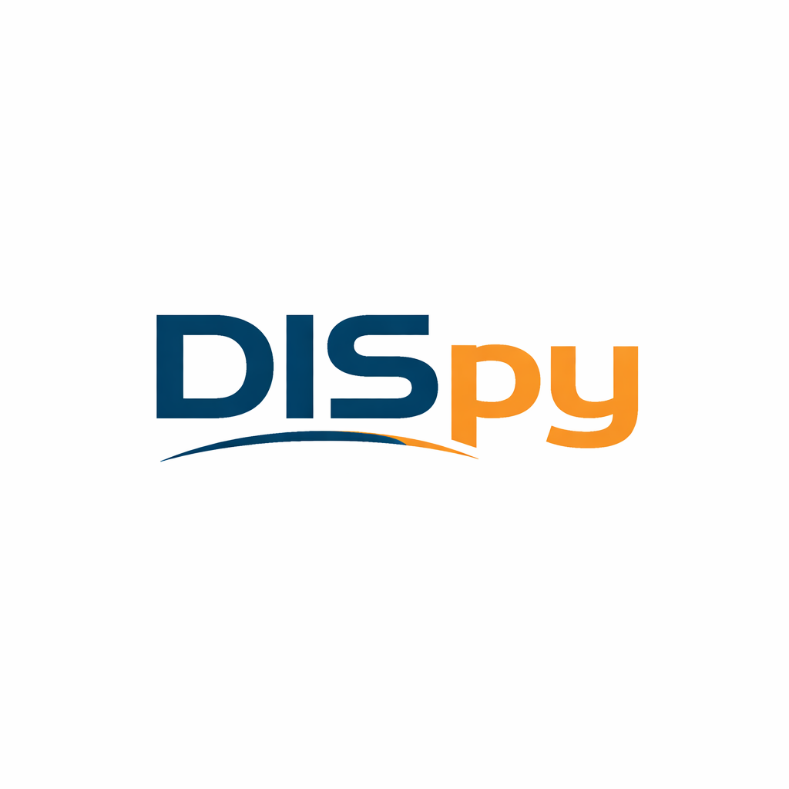

DISpy
=============================================
|logo|

DISpy provides an efficient framework for surface-wave dispersion inversion based on distributed acoustic sensing (DAS) data. Through an intuitive graphical user interface, users can perform DAS-based ambient noise imaging within a unified workflow, including data reading, preprocessing, cross-correlation computation, dispersion calculation and extraction, and inversion, together with auxiliary functions such as F–K analysis and sensitivity kernel computation.

Contents
=============================================

.. toctree::
   :maxdepth: 3
   
   Installation
   UI_intro
   CrossCorrelation

.. 索引和表格
.. ==================

.. * :ref:`genindex`
.. * :ref:`modindex`
.. * :ref:`search`

If you have any questions, please contact `<shr0928@mail.ustc.edu.cn>`_.
