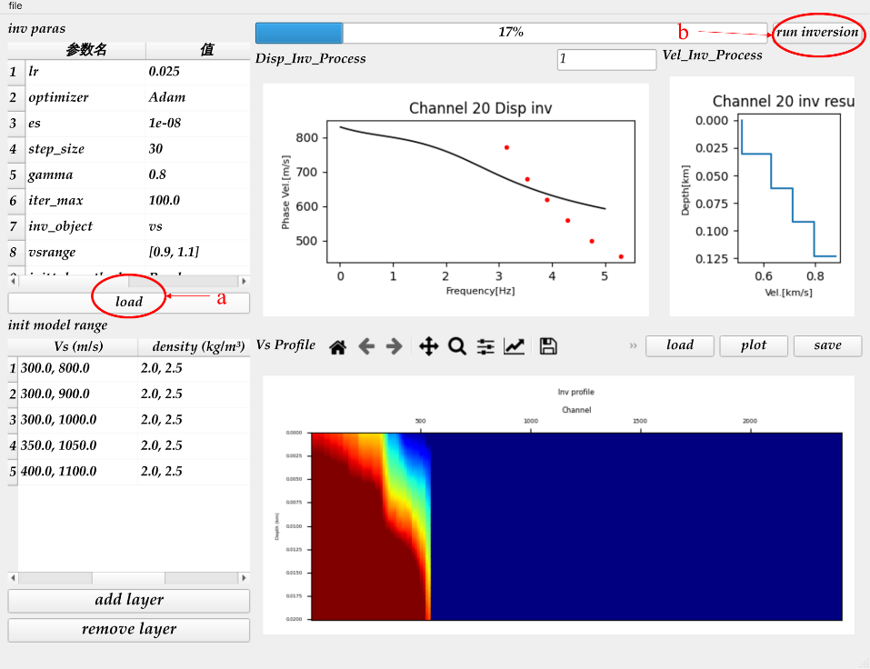

Inversion
==================================================

1. Module Introduction
-----------------

The inversion module in DISpy is implemented as an independent 
and fully integrated functional unit for surface-wave dispersion 
inversion . It provides a unified graphical interface 
for hyperparameter configuration, model initialization, real-time 
monitoring, and result visualization.

The interface consists of five functional windows:

- Inversion hyperparameter configuration window  
- Initial velocity model window  
- Dispersion comparison window  
- 1D velocity model monitoring window  
- 2D inversion profile visualization window  

These components collectively support the complete inversion 
workflow, from parameter setup and initial model construction 
to convergence monitoring and final result evaluation.

The integrated visual framework enhances inversion transparency, 
stability control, and interpretability.

2. Parameter Descriptions
-----------------

**lr** (float)  
  Initial learning rate of the optimization process.  
  Controls convergence speed and stability.  
  Larger values accelerate updates but may cause oscillation.

**optimizer** (str)  
  Specifies the optimization algorithm.  
  Supported backends include SciPy and PyTorch optimizers.  
  Different optimizers exhibit varying convergence behavior.

**es** (float)  
  Early stopping threshold.  
  If the improvement between consecutive iterations falls below 
  this value, inversion terminates automatically.

**iter_max** (int)  
  Maximum number of iterations allowed during inversion.  
  Prevents excessive computational cost.

**step_size** (int)  
  Learning rate update interval.  
  Defines the number of iterations between decay operations.

**gamma** (float)  
  Learning rate decay factor.  
  After each ``step_size`` interval, the learning rate is multiplied 
  by ``gamma`` to improve late-stage stability.

**inv_object** (str)  
  Specifies the inversion target parameter.  
  For example, ``Vs`` indicates shear-wave velocity inversion only.

**vsrange** (array)  
  Permissible range of Vs values.  
  Prevents nonphysical parameter updates.

**initial_method** (str)  
  Empirical relationship used to estimate non-inverted parameters 
  (e.g., Vp).  
  Default is the Brocher empirical relation.

**model_num** (int)  
  Number of randomly generated initial models.  
  Multiple initializations reduce dependence on a single starting model.

**ls** (Boolean)  
  If ``True``, least-squares objective function is adopted.  
  Suitable when residuals approximately follow Gaussian distribution.

**device** (str)  
  Specifies computation device.  

  - ``cuda`` — GPU acceleration  
  - ``cpu`` — CPU execution  

3. Workflow
-----------------

|inv|

This section describes the operational procedure of the inversion module, 
from dispersion data preparation to final result export.

3.1 Workflow Overview
~~~~~~~~~~~~~~~~~~~~~~~~~

+----------------------------+----------------------------------------------+
| Stage                      | Core Function                                |
+============================+==============================================+
| Data Preparation           | Load verified dispersion curves              |
+----------------------------+----------------------------------------------+
| Model Initialization       | Configure layer structure and velocity range |
+----------------------------+----------------------------------------------+
| Parameter Loading          | Load and verify inversion hyperparameters    |
+----------------------------+----------------------------------------------+
| Inversion Execution        | Iterative optimization and model updating    |
+----------------------------+----------------------------------------------+
| Real-time Monitoring       | Dispersion fitting and model evolution       |
+----------------------------+----------------------------------------------+
| Profile Construction       | Generate 2D velocity section                 |
+----------------------------+----------------------------------------------+
| Result Saving              | Export inversion results                     |
+----------------------------+----------------------------------------------+

3.2 Detailed Operational Procedure
~~~~~~~~~~~~~~~~~~~~~~~~~~~~~~~~~~~~~

Data Preparation
^^^^^^^^^^^^^^^^^^^^^^^^

Inversion requires valid dispersion curves to be loaded beforehand.

Users may:

- Load dispersion data directly using ``disp_load``  
- Extract dispersion curves via manual or automatic picking  

The inversion window initializes only after dispersion data 
are successfully verified.

Model Initialization
^^^^^^^^^^^^^^^^^^^^^^^^

After entering the inversion module, a default model range is 
automatically generated.

Users may adjust:

- Number of layers (``add layer`` / ``remove layer``)  
- Layer thickness  
- Velocity bounds  

Manual parameter editing is supported in the initial model window.

Parameter Loading
^^^^^^^^^^^^^^^^^^^^^^^^

Click ``load`` to import predefined inversion parameters.

Unlike the dispersion module, inversion strategy selection 
is configured directly through parameter fields rather than 
a dedicated method selection panel.

Inversion Execution
^^^^^^^^^^^^^^^^^^^^^^^^

Click ``run_inversion`` to start the iterative optimization process.

The progress bar displays runtime status.

During computation:

- Dispersion comparison window dynamically updates fitting curves  
- 1D velocity window displays intermediate model evolution  

Users may monitor convergence behavior in real time.

Profile Construction
^^^^^^^^^^^^^^^^^^^^^^^^

Even before full completion, intermediate 1D inversion results 
can be stitched into a 2D velocity profile.

Click ``plot`` to visualize the evolving section.

Continuous updating allows tracking of structural refinement 
throughout inversion.

Result Saving
^^^^^^^^^^^^^^^^^^^^^^^^

After completion:

- Click ``save`` to export the final 2D inversion profile  
- Use ``load`` to reload previously saved results  
- Display parameters can be adjusted within the plotting window  

